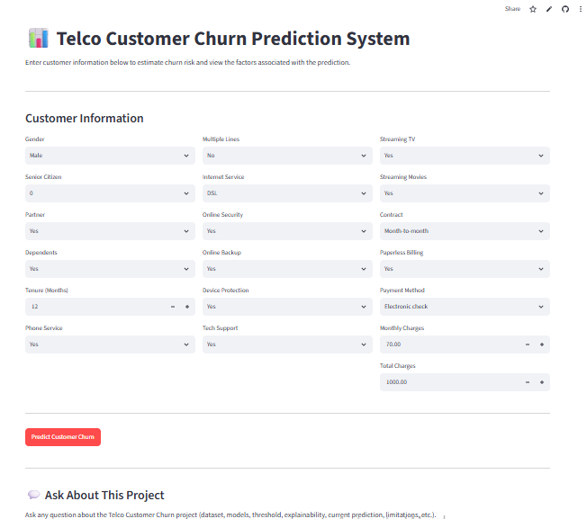

# Customer Churn Prediction & Explainable AI System

## 📌 Project Overview

Customer churn is an important business problem because identifying customers who are likely to leave can help organizations prioritize retention efforts.

This project develops an end-to-end **machine learning customer churn prediction system** using the Telco Customer Churn dataset.

The project goes beyond simply predicting churn. It combines:

* Exploratory Data Analysis
* Data preprocessing
* Multiple machine learning models
* Model evaluation and comparison
* Cross-validation
* Hyperparameter tuning
* Decision-threshold analysis
* Individual customer-level explainability
* K-Means clustering and PCA exploration
* Local Large Language Model (LLM) integration
* AI response validation and safety controls
* Streamlit deployment prototyping

The final system separates the **machine-learning prediction** from the **generative-AI explanation**, ensuring that the LLM communicates verified model results rather than determining or changing them.

---
# 🔗 Live Application

Try the deployed application:

👉 **[Launch the Telco Customer Churn AI App](https://ochieng-felix-telco-customer-churn-ai-appapp-qezax4.streamlit.app/)**

The application allows users to:

- Enter customer information
- Generate a churn prediction
- View churn probability and risk level
- Review customer-level risk factors
- View a business-readable explanation
- Verify AI-generated communication through safety validation
- Ask questions about the project's methodology and technical decisions
- 
## 🎯 Business Problem

Customer churn can affect customer retention and recurring business relationships.

The objective of this project is to answer:

> **Which customers are at higher risk of churn, and what model-derived factors contribute to that prediction?**

The system predicts whether a customer is likely to belong to the:

* **No Churn** class
* **Churn** class

The positive class is:

```text
Churn = Yes
```

Because missing an actual churner is considered more costly than unnecessarily contacting a customer who remains, **recall is an important business metric**.

However, recall is not evaluated in isolation. Precision, F1-score, ROC-AUC, and the broader business trade-off are also considered.

---

# 📊 Dataset

The project uses the **Telco Customer Churn dataset**.

The original dataset contains:

* **7,043 customers**
* **21 columns**

After separating the target and customer identifier, the modeling dataset contains **19 predictor variables**.

### Target Variable

```text
Churn
```

Classes:

```text
Yes
No
```

### Important Features

The dataset contains customer information relating to:

* Demographics
* Tenure
* Phone services
* Internet services
* Online services
* Streaming services
* Contract type
* Billing
* Payment method
* Monthly charges
* Total charges

---

# 🔎 Exploratory Data Analysis

The analysis investigated customer churn across multiple dimensions.

Some important patterns identified during exploration included:

### Contract Type

Month-to-month customers showed substantially higher churn than customers on longer-term contracts.

### Internet Service

Fiber optic customers showed a higher observed churn rate than DSL and customers without internet service.

### Tenure

Customers with longer tenure generally demonstrated lower churn rates, while newer customers represented a higher-risk segment.

### Payment Method

Electronic check customers showed the highest observed churn rate among the payment methods examined.

### Billing

Customers using paperless billing showed a higher observed churn rate than customers using non-paperless billing.

These observations were used for business understanding and feature investigation rather than being treated as causal relationships.

---

# 🧹 Data Preprocessing

The modeling workflow included:

### Numerical Features

Numerical variables included:

* SeniorCitizen
* tenure
* MonthlyCharges
* TotalCharges

Numerical features were standardized using:

```python
StandardScaler()
```

### Categorical Features

Categorical variables were transformed using:

```python
OneHotEncoder(handle_unknown="ignore")
```

### Missing Total Charges

`TotalCharges` initially required handling because some new customers did not yet have accumulated charges.

These values were treated as zero based on the business interpretation that a new customer with no accumulated tenure may not yet have accumulated total charges.

### Train/Test Split

The dataset was divided into:

```text
80% Training
20% Testing
```

with stratification applied to preserve the class distribution.

### Pipeline

Preprocessing and modeling were combined into a Scikit-learn pipeline to reduce the risk of inconsistent transformations and data leakage.

---

# 🤖 Machine Learning Models

Several classification algorithms were evaluated:

1. Logistic Regression
2. Decision Tree
3. Random Forest
4. K-Nearest Neighbors (KNN)

The models were evaluated using:

* Accuracy
* Precision
* Recall
* F1-score
* ROC-AUC
* Confusion Matrix

---

# 📈 Baseline Model Results

| Model               | Accuracy | Precision | Recall |     F1 | ROC-AUC |
| ------------------- | -------: | --------: | -----: | -----: | ------: |
| Logistic Regression |   0.8055 |    0.6572 | 0.5588 | 0.6040 |  0.8421 |
| Decision Tree       |   0.7211 |    0.4755 | 0.4920 | 0.4836 |  0.6477 |
| Random Forest       |   0.7864 |    0.6254 | 0.4866 | 0.5474 |  0.8185 |
| KNN                 |   0.7637 |    0.5527 | 0.5749 | 0.5636 |  0.7896 |

Logistic Regression produced the strongest baseline ROC-AUC and accuracy among the evaluated models.

KNN produced slightly higher recall than baseline Logistic Regression, demonstrating why model selection should consider the business objective rather than accuracy alone.

---

# ⚙️ Model Tuning

Cross-validation and hyperparameter tuning were subsequently performed.

The tuned Logistic Regression model selected:

```text
C = 1
class_weight = balanced
max_iter = 1000
```

The best cross-validation recall was approximately:

```text
0.8040
```

The tuned model produced:

| Metric    | Result |
| --------- | -----: |
| Accuracy  | 0.7381 |
| Precision | 0.5043 |
| Recall    | 0.7834 |
| F1-score  | 0.6136 |
| ROC-AUC   | 0.8416 |

The increase in recall came with a reduction in precision.

This demonstrates an important business trade-off:

> Improving recall can cause the model to classify more customers as potential churners, increasing the number of customers requiring attention.

---

# 🎚️ Decision Threshold Analysis

Instead of automatically relying on the default classification threshold, different probability thresholds were investigated.

The selected decision threshold for the final demonstration was:

```text
0.35
```

This allows the business to make the classification rule more sensitive to potential churners.

The threshold should therefore be viewed as a **business decision parameter**, not as an immutable property of the model.

---

# 🔍 Customer-Level Explainability

The system provides an explanation for an individual prediction using the Logistic Regression model's coefficients and the customer's transformed feature values.

For each transformed feature:

```text
Contribution = Feature Value × Model Coefficient
```

Positive contribution values are associated with higher predicted churn risk.

Negative contribution values are associated with lower predicted churn risk.

The technical feature names are subsequently converted into business-readable names.

---

# 👤 Example Customer Prediction

For the demonstration customer, the model produced:

```text
Churn Probability: 91.37%
Decision Threshold: 0.35
Prediction: Yes
Risk Level: High
```

### Higher-Risk Signals

The strongest positive contributions were:

1. Tenure
2. Fiber optic internet service
3. Month-to-month contract
4. Streaming Movies
5. Streaming TV

### Lower-Risk Signals

The strongest negative contributions were:

1. Monthly charges
2. Total charges
3. No multiple lines
4. No partner
5. Phone service

These factors represent **model-associated contributions**, not causal explanations.

---

# 🧠 Local LLM Integration

A local Large Language Model was integrated to convert the verified machine-learning output into a business-readable explanation.

The architecture intentionally separates:

### Machine Learning Layer

Responsible for:

* Prediction
* Probability
* Risk classification
* Feature contributions

### Generative AI Layer

Responsible for:

* Communicating the verified results
* Producing a readable business explanation

The LLM is **not responsible for determining the customer's churn probability or prediction**.

---

# 🛡️ AI Safety & Validation Layer

A major component of this project is the validation layer between the LLM and the final business output.

The generated response is checked before it is accepted.

The validation system checks:

### JSON Structure

Ensures the response follows the required structured format.

### Model Values

Verifies that the AI does not change:

* Churn probability
* Decision threshold
* Prediction
* Risk level

### Factor Integrity

Ensures that the AI only communicates factors supplied by the verified model output.

### Factor Completeness

Ensures that required higher-risk and lower-risk factors are not silently removed.

### Forbidden Claims

The system detects unsupported claims such as:

* Guaranteed future churn
* Invented prediction horizons
* Unsupported financial claims
* Invented discounts
* Invented offers
* Unsupported business actions

---
# 💬 Project AI Assistant

The application also includes a Project AI Assistant designed to answer questions about the Telco Customer Churn project.

Users can ask questions about areas such as:

- Why Logistic Regression was selected
- Which models were evaluated
- Why recall was considered important
- How the decision threshold was selected
- How customer-level explainability works
- How preprocessing was performed
- What evaluation metrics were used
- How the AI safety validation system works
- Why the LLM does not control the ML prediction
- The difference between prediction, explanation, and validation

The assistant is designed as a project knowledge and communication layer.

Its role is to explain the methodology and decisions behind the project rather than modify verified machine-learning results.

This provides an additional interactive layer that allows users, recruiters, and stakeholders to explore the technical and business reasoning behind the system.

# 🔐 Verified Output Architecture

The final architecture follows:

```text
Customer Data
      │
      ▼
Data Preprocessing
      │
      ▼
Trained ML Model
      │
      ├──────────────► Churn Probability
      │
      ├──────────────► Prediction
      │
      ├──────────────► Risk Level
      │
      └──────────────► Feature Contributions
                         │
                         ▼
                  VERIFIED PAYLOAD
                         │
                         ▼
                    Local LLM
                         │
                         ▼
                  Generated Response
                         │
                         ▼
                  Safety Validator
                    │          │
                  PASS        FAIL
                    │          │
                    ▼          ▼
              AI_APPROVED   AI_REJECTED
```

This design establishes a clear separation between **prediction**, **explanation**, and **validation**.

---

# 🧪 Safety Testing

The safety system was tested against multiple scenarios.

### Test 1 — Valid Response

```text
Result: APPROVED
```

The response contained the correct model values and all required factors.

### Test 2 — Missing Factors

```text
Result: REJECTED
```

The validator detected missing higher-risk and lower-risk factors.

### Test 3 — Invented Business Recommendation

Example:

```text
Offer the customer a 30% discount.
```

```text
Result: REJECTED
```

The validator detected unsupported terms such as:

```text
discount
offer
```

### Test 4 — Altered Model Output

The AI response attempted to change:

```text
Probability: 0.9137 → 0.70
Threshold: 0.35 → 0.50
Prediction: Yes → No
Risk: High → Low
```

```text
Result: REJECTED
```

The validator correctly detected the altered model values.

---

# 💡 Key Technical Insight

The project demonstrates an important principle when combining machine learning with generative AI:

> **The LLM should communicate verified model results rather than become the source of truth for those results.**

The machine-learning system remains responsible for the prediction.

The LLM acts as a communication layer.

The validation layer determines whether the generated explanation is safe to pass to the final user.

---

# 🚀 Deployment

The Telco Customer Churn AI system is deployed as an interactive Streamlit application.

## 🔗 Live Application

👉 **[Launch the Application](https://ochieng-felix-telco-customer-churn-ai-appapp-qezax4.streamlit.app/)**

The deployed application provides an interactive interface where users can:

1. Enter customer information
2. Generate a churn prediction
3. View the churn probability
4. View the selected decision threshold
5. View the predicted churn class
6. View the customer risk level
7. Explore higher-risk and lower-risk model signals
8. Review AI-generated business communication
9. Verify that AI output passed the safety validation layer
10. Ask questions about the project methodology

The deployment demonstrates how the machine-learning model, explainability system, AI communication layer, and validation controls can be integrated into a single user-facing application.

# 📸 Application Preview



# 🗂️ Project Structure

```text
customer-churn-ai/
│
├── README.md
│
├── notebooks/
│   └── customer_churn_analysis.ipynb
│
├── models/
│   ├── churn_model.pkl
│   └── feature_name_map.pkl
│
├── app/
│   └── app.py
│
├── screenshots/
│   ├── model_performance.png
│   ├── churn_explanation.png
│   ├── ai_safety_validation.png
│   └── streamlit_app.png
│
├── requirements.txt
│
└── .gitignore
```

---

# 🛠️ Technologies Used

* Python
* Pandas
* NumPy
* Matplotlib
* Seaborn
* Scikit-learn
* Logistic Regression
* Decision Trees
* Random Forest
* KNN
* K-Means
* PCA
* Local LLM
* llama-cpp-python
* Streamlit
* Google Colab
* GitHub

---

# 📚 Key Skills Demonstrated

### Data Science

* Data cleaning
* Exploratory data analysis
* Feature engineering
* Statistical reasoning
* Data preprocessing

### Machine Learning

* Classification
* Model comparison
* Cross-validation
* Hyperparameter tuning
* Threshold optimization
* Model evaluation
* Feature interpretation

### Explainable AI

* Individual prediction explanations
* Logistic Regression coefficient interpretation
* Feature contribution analysis
* Business-friendly feature naming

### Generative AI

* Local LLM integration
* Structured AI output
* Prompt engineering
* JSON-based communication

### AI Safety

* Output validation
* Model-value integrity checking
* Factor integrity checking
* Completeness validation
* Forbidden-claim detection
* Human decision-maker control

### Deployment

* Streamlit application development
* Model serialization
* Temporary cloud tunneling
* Application prototyping

---

# 🎯 Future Improvements

Potential future improvements include:

* Testing additional classification algorithms
* Calibrating predicted probabilities
* More extensive threshold optimization using quantified business costs
* Automated monitoring of model performance
* Model drift detection
* More advanced explainability methods such as SHAP
* A more robust production deployment environment
* Authentication and access controls
* Automated testing through CI/CD

---

# ⚠️ Important Disclaimer

The predictions generated by this project are model outputs and should not be interpreted as certainty.

Feature contributions indicate associations within the model and should not be interpreted as causal relationships.

The final business decision remains with a human decision-maker.

---

# 👨‍💻 Author

**Ochieng' Felix Otieno**

Bachelor of Information Technology
Aspiring Data Scientist | Machine Learning | Data Analytics | AI

GitHub:

`https://github.com/OCHIENG-FELIX`

---

## ⭐ Project Highlights

This project demonstrates an end-to-end progression from:

Raw Customer Data

→ Exploratory Data Analysis

→ Data Preprocessing

→ Machine Learning

→ Model Evaluation

→ Cross-Validation & Hyperparameter Tuning

→ Decision Threshold Analysis

→ Customer-Level Explainability

→ Local Generative AI Communication

→ AI Safety Validation

→ Verified ML Output Integrity

→ Interactive Streamlit Deployment

→ Project AI Assistant

The project demonstrates how machine learning and generative AI can be integrated while maintaining a clear separation between:

**Prediction → Explanation → Validation → Human Decision-Making**

The machine-learning model remains the source of truth for predictions, while the AI layer is used for communication and project-level interaction.
